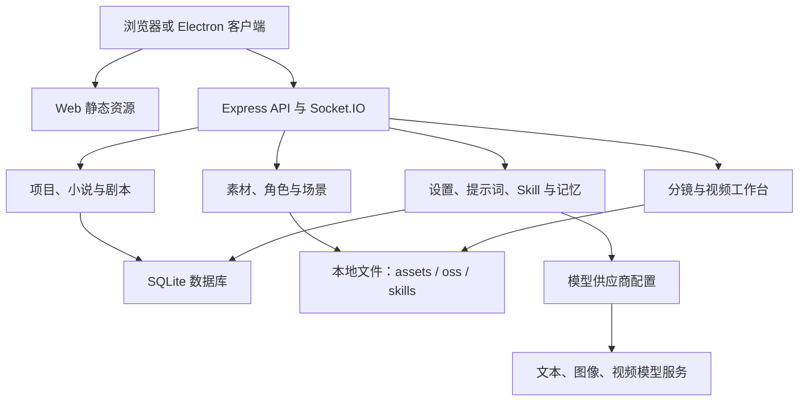

# Toonflow-app

一个面向短剧创作流程的本地 AI 工作台。项目将小说与剧本处理、角色与素材管理、分镜生成、视频任务和成片工作台组织在同一套项目上下文中，适合本地部署、调试和定制。

> 项目状态：可本地运行，包含服务端、内置 Web 静态资源与 Electron 桌面端构建能力。模型生成依赖自行配置的模型服务；本仓库不提供模型额度、托管服务或内容版权授权。

## 目录

- [核心能力](#核心能力)
- [架构](#架构)
- [使用流程](#使用流程)
- [快速开始](#快速开始)
- [模型与数据配置](#模型与数据配置)
- [运行与部署](#运行与部署)
- [项目结构](#项目结构)
- [验证与贡献](#验证与贡献)
- [许可证](#许可证)

## 核心能力

| 系统 | 能力 | 解决的问题 |
| --- | --- | --- |
| 项目与小说 | 项目、小说章节、事件与创作手册管理 | 为长内容改编保留可编辑的上下文和结构化素材。 |
| 剧本工作流 | 剧本计划、脚本生成、编辑、导出与素材提取 | 将故事设定转化为后续制作可使用的脚本内容。 |
| 素材与角色 | 图像、音频、角色与场景素材的创建、上传、更新和批量生成 | 集中管理生成与人工补充的创作资产。 |
| 分镜与生产 | 分镜维护、批量出图、画面编辑、提示词与视频任务 | 把脚本和素材落实为可调整的镜头生产流程。 |
| 工作台 | 视频轨道、时长、预览、选择和删除等操作 | 在同一项目中组织视频生成结果与剪辑前的任务状态。 |
| 设置与扩展 | 模型供应商、模型映射、提示词、Skill、记忆和数据管理 | 让模型与工作流配置可以在应用内维护。 |

除业务流程外，应用还提供登录鉴权、SQLite 持久化、本地文件服务、Socket.IO 实时通信，以及面向文本、图像和视频模型的可配置供应商接口。

## 架构



服务端由 Express 提供 HTTP 接口与静态资源，Socket.IO 用于实时任务通信。项目数据保存在 SQLite 中；上传文件、生成素材和 Skill 资源保存在应用数据目录。模型请求通过应用内的供应商配置发出，模型服务地址和凭据由部署者自行管理。

## 使用流程

一个典型的本地创作流程如下：

1. 启动应用，完成初始登录与本地账号配置。
2. 在设置中配置并测试文本、图像和视频模型供应商。
3. 创建项目，导入或录入小说与章节内容；按需生成和维护章节事件。
4. 在剧本模块编写或生成故事结构、剧本和素材描述。
5. 创建角色、场景与其他素材，生成或上传图像、音频等资源。
6. 维护分镜和镜头提示词，批量提交图像或视频生成任务。
7. 在工作台查看视频任务结果、管理轨道与时长，并导出或继续编辑项目资产。

生成结果受模型能力、输入内容和第三方服务限制影响。请在提交批量任务前检查模型配置、计费方式和素材授权。

## 快速开始

### 前置条件

- Node.js 24
- Yarn 1.x
- 可用的文本、图像或视频模型服务（仅在使用对应生成能力时需要）

### 安装

```bash
git clone https://github.com/Yangheyu123/Toonflow-app.git
cd Toonflow-app
yarn install --frozen-lockfile
```

### 启动服务

```bash
yarn dev
```

开发服务默认监听 `http://localhost:10588`。启动后在浏览器中打开该地址即可访问内置 Web 界面。

### 桌面端开发

```bash
yarn dev:gui
```

Electron 模式会使用操作系统的用户数据目录保存运行数据；直接运行服务端时，数据目录位于项目根目录的 `data/` 下。

## 模型与数据配置

### 模型供应商

在应用的设置界面添加供应商并配置模型。供应商定义支持文本、图像和视频三类模型，以及不同的输入模式与视频时长/分辨率组合。应用同时提供模型测试、启用/禁用和提示词映射能力。

API Key、服务地址和其他凭据属于本地运行配置：

- 不要把真实凭据写入源码、README、提交记录或公开 Issue。
- 使用最小权限的密钥，并为不同环境分别配置。
- 运行生成任务前确认第三方模型服务的计费、内容政策与数据处理规则。
- 不要将默认账号或弱密码暴露在公网；生产部署前应完成账号与访问控制配置。

### 本地数据

应用在数据目录中维护数据库、素材和静态资源。常见目录包括：

| 路径 | 用途 |
| --- | --- |
| `data/` | 服务端运行时的数据根目录与内置资源。 |
| `data/assets/` | 应用素材和静态资产。 |
| `data/oss/` | 上传与生成的文件资源。 |
| `data/skills/` | 可编辑的创作 Skill 与相关资源。 |

数据目录包含项目和创作素材。升级、迁移、清理数据库或重新部署前，请先备份需要保留的内容。

## 运行与部署

### 构建生产产物

```bash
yarn build
yarn start
```

`yarn build` 会构建服务端产物，`yarn start` 运行 `data/serve/app.js`。生产环境应使用反向代理提供 HTTPS，并将运行数据目录置于可持久化存储中。

### Docker

仓库提供面向开发服务的 `Dockerfile`：

```bash
docker build -t toonflow-app .
docker run --rm -p 10588:10588 toonflow-app
```

该镜像默认执行 `yarn dev`，适合本地验证和开发调试。正式部署前，请自行补充持久化卷、反向代理、访问控制、日志和密钥管理配置；不要直接将开发服务暴露到公网。

### 常用命令

| 命令 | 说明 |
| --- | --- |
| `yarn dev` | 启动服务端开发模式。 |
| `yarn build` | 构建生产服务端产物。 |
| `yarn start` | 运行已构建的服务。 |
| `yarn lint` | 执行 TypeScript 类型检查。 |
| `yarn dev:gui` | 启动 Electron 开发模式。 |
| `yarn dist` | 构建当前平台的桌面端安装包。 |
| `yarn dist:win` | 构建 Windows 安装包。 |
| `yarn dist:mac` | 构建 macOS 安装包。 |
| `yarn dist:linux` | 构建 Linux 安装包。 |

## 项目结构

```text
src/
  routes/       API 路由：项目、小说、剧本、素材、生产、设置等
  socket/       实时通信与任务事件
  agents/       Agent 相关逻辑
  utils/        数据库、文件、模型调用等通用能力
  app.ts        Express 服务入口
data/
  models/       本地模型与向量检索资源
  skills/       创作 Skill、提示词和预设资源
  serve/        已构建的服务端产物
  web/          内置 Web 静态资源
scripts/        构建、许可证和维护脚本
docs/           多语言说明与项目资源
```

## 验证与贡献

提交修改前，至少执行以下检查：

```bash
yarn lint
yarn build
```

提交 Issue 或 Pull Request 时，请说明修改目标、复现步骤或验证方式。涉及模型调用、生成任务或数据结构的改动，应同时说明兼容性影响；涉及素材、提示词和示例数据的改动，应确认其授权与来源。

## 许可证

本项目采用 [Apache License 2.0](./LICENSE)。依赖项及其通知信息见 [NOTICES.txt](./NOTICES.txt)。第三方模型服务、素材、字体、图片、音频和视频可能受独立的服务条款、隐私政策或知识产权约束；项目许可证不授予这些第三方内容或服务的使用权。
